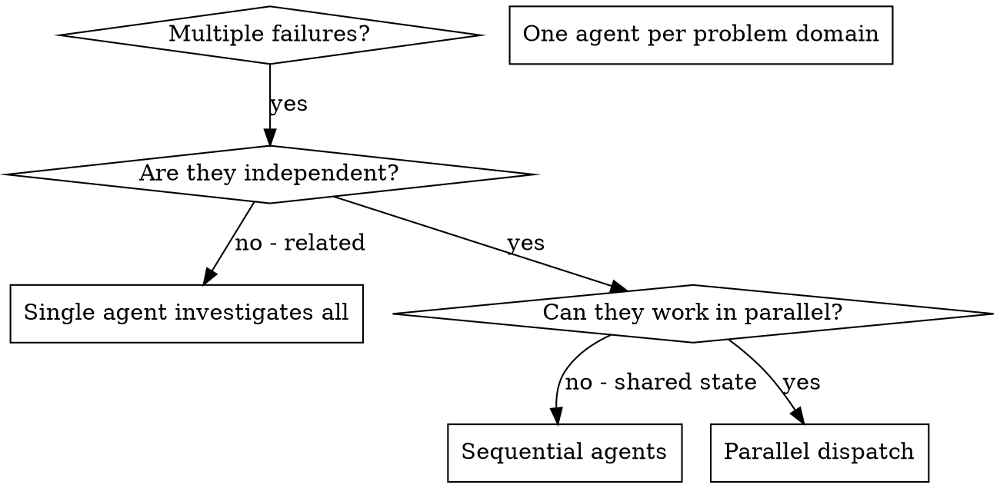

# dispatching-parallel-agents

**Category:** AI, Agents & Prompt Engineering
**Platform:** Gemini / Plugins
**Original Path:** gemini/mongodb-internal/.agents/skills/before-you-code/dispatching-parallel-agents/skills/dispatching-parallel-agents

## Description
Use when facing 2+ independent tasks that can be worked on without shared state or sequential dependencies

---

# Dispatching Parallel Agents

## Overview

You delegate tasks to specialized agents with isolated context. By precisely crafting their instructions and context, you ensure they stay focused and succeed at their task. They should never inherit your session's context or history — you construct exactly what they need. This also preserves your own context for coordination work.

When you have multiple unrelated failures (different test files, different subsystems, different bugs), investigating them sequentially wastes time. Each investigation is independent and can happen in parallel.

**Core principle:** Dispatch one agent per independent problem domain. Let them work concurrently.

## When to Use



**Use when:**
- Multiple independent problems to investigate, fix, or author
- Problems span different subsystems, services, or workstreams
- Each problem can be understood without context from the others
- No shared state between the work items

**Don't use when:**
- Problems are related (working one might resolve others)
- You need to understand the full system state first
- Agents would interfere with each other (same files, same resources)

## The Pattern

### 1. Identify Independent Domains

Group work by what it touches:
- Domain A: a broken module build
- Domain B: a latency investigation on a different service
- Domain C: drafting a deploy script for a new environment

Each domain is independent — fixing the build doesn't affect the investigation or the script.

### 2. Create Focused Agent Tasks

Each agent gets:
- **Specific scope:** one module, service, or artifact
- **Clear goal:** the exact deliverable (passing build, root-cause report, finished script)
- **Constraints:** what NOT to touch (e.g. "don't modify production code", "investigation only")
- **Expected output:** the shape of the return (summary, evidence, file paths)

### 3. Dispatch in Parallel

Issue all three subagent dispatches in the same response — they run in parallel:

```text
Subagent (general-purpose): "Fix failing build of module <X>"
Subagent (general-purpose): "Trace why log pattern <Y> spikes on weekends"
Subagent (general-purpose): "Draft a deploy script for service <Z>"
# All three run concurrently.
```

Multiple dispatch calls in one response = parallel execution. One per response = sequential.

### 4. Review and Integrate

When agents return:
- Read each summary
- Verify fixes don't conflict
- Run full test suite
- Integrate all changes

## Agent Prompt Structure

Good agent prompts are:
1. **Focused** - One clear problem domain
2. **Self-contained** - All context needed to understand the problem
3. **Specific about output** - What should the agent return?

```markdown
Investigate why <service-X> p99 latency regressed after deploy <D>:

1. The regression appears on <dashboard-link> starting <timestamp>.
2. Recent changes landed in <commit range>.
3. No alerts fired on upstream dependencies.

Your task:
1. Compare metrics before/after the deploy window.
2. Identify which endpoint(s) contribute most to the regression.
3. Correlate with code changes in <commit range>.

Constraint: Do not ship fixes — investigation only.

Return: Suspected root cause + evidence (dashboards, log patterns, diffs).
```

## Common Mistakes

**❌ Too broad:** "Fix everything broken" — agent gets lost
**✅ Specific:** "Investigate p99 regression in service X since deploy D" — focused scope

**❌ No context:** "Figure out what's wrong" — agent doesn't know where to look
**✅ Context:** Paste the symptoms, dashboard links, error messages, commit ranges

**❌ No constraints:** Agent might refactor everything
**✅ Constraints:** "Do NOT change production code" or "Investigation only, no fixes"

**❌ Vague output:** "Fix it" — you don't know what changed
**✅ Specific:** "Return root cause + evidence + proposed fix (do not apply it)"

## When NOT to Use

**Related failures:** Fixing one might fix others - investigate together first
**Need full context:** Understanding requires seeing entire system
**Exploratory debugging:** You don't know what's broken yet
**Shared state:** Agents would interfere (editing same files, using same resources)

## Real Example

**Scenario:** Three unrelated workstreams hit the backlog the same morning.

**Independent problems:**
- Module A: build broken on a specific variant — root cause in toolchain config
- Service B: log pattern spikes weekly — needs dashboard + query analysis
- Service C: no deploy script exists for the new environment — pure authoring

**Decision:** Independent domains — no shared state, no sequencing.

**Dispatch:**
```
Agent 1 → Investigate and fix module A build failure
Agent 2 → Analyze service B log-spike pattern, return root cause + evidence
Agent 3 → Draft a deploy script for service C (new environment)
```

**Results:**
- Agent 1: Found stale dependency lock; updated lock and rebuilt clean.
- Agent 2: Identified a cron job triggering a fan-out query; produced dashboard link + query excerpt.
- Agent 3: Delivered a working deploy script + checklist; no changes to production code.

**Integration:** All outputs independent, no conflicts, all three completed in one cycle.

**Time saved:** 3 problems handled in parallel vs sequentially.

## Key Benefits

1. **Parallelization** - Multiple investigations happen simultaneously
2. **Focus** - Each agent has narrow scope, less context to track
3. **Independence** - Agents don't interfere with each other
4. **Speed** - 3 problems solved in time of 1

## Verification

After agents return:
1. **Review each summary** - Understand what changed
2. **Check for conflicts** - Did agents edit same code?
3. **Run full suite** - Verify all fixes work together
4. **Spot check** - Agents can make systematic errors

## Real-World Impact

From debugging session (2025-10-03):
- 6 failures across 3 files
- 3 agents dispatched in parallel
- All investigations completed concurrently
- All fixes integrated successfully
- Zero conflicts between agent changes